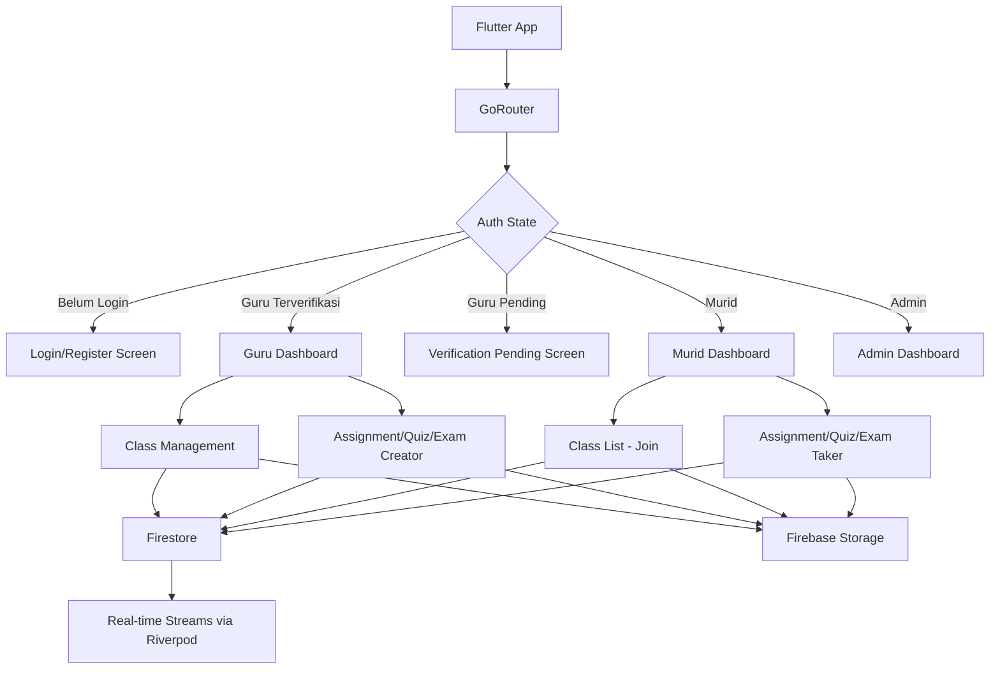
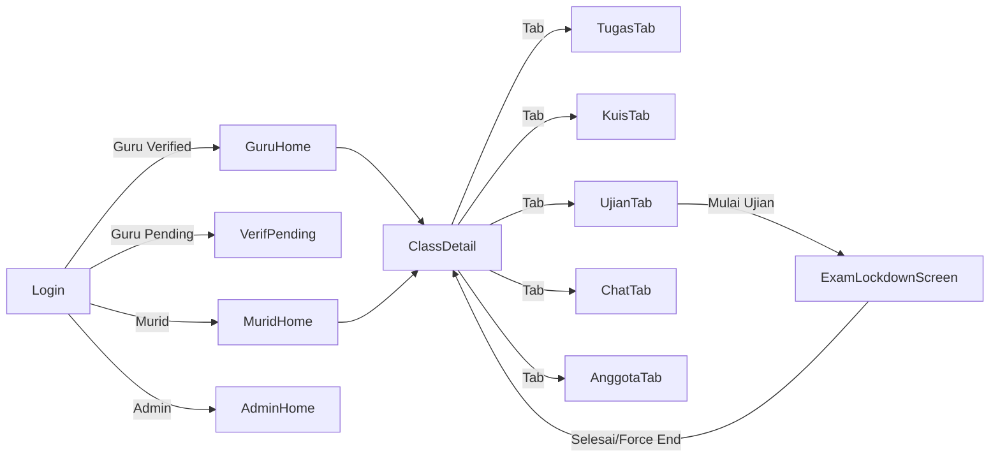
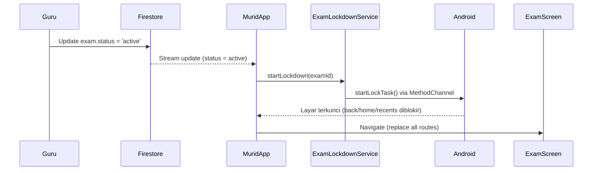
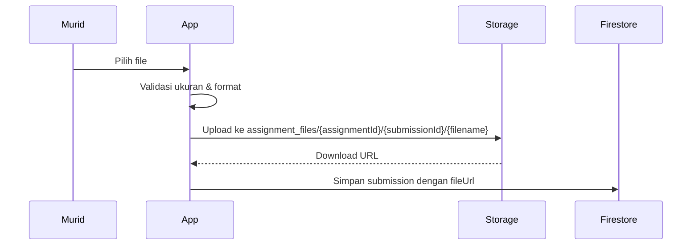
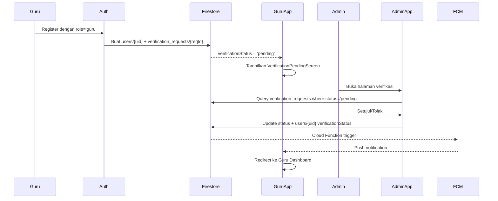

# Dokumen Desain Teknis: School App (q_les)

## Overview

Aplikasi **q_les** adalah platform pembelajaran sekolah berbasis Flutter yang menyatukan manajemen kelas, tugas, kuis, ujian, dan komunikasi dalam satu APK. Aplikasi ini melayani dua peran utama (Guru dan Murid) dengan satu tambahan peran Admin untuk verifikasi.

Backend sepenuhnya berbasis Firebase:
- **Firebase Auth** — autentikasi email/password
- **Firestore** — database utama (real-time streams)
- **Firebase Storage** — file lampiran & foto profil
- **FCM (Firebase Cloud Messaging)** — notifikasi push

Fitur kritis yang membedakan aplikasi ini dari aplikasi sekolah biasa adalah **Mode Ujian (Exam Lockdown)** yang mengunci perangkat Android selama ujian berlangsung menggunakan Android Task Affinity + `SystemAlertWindow` + `AccessibilityService`.

---

## Architecture

### Pola Arsitektur

Aplikasi menggunakan pola **Feature-First Clean Architecture** dengan tiga lapisan:

```
Presentation Layer  →  Business Logic Layer  →  Data Layer
(Widgets/Screens)      (Providers/Notifiers)    (Services/Repositories)
```

**State Management**: Riverpod (dengan `flutter_riverpod` + `riverpod_annotation`)
- Dipilih karena mendukung async state, dependency injection, dan testability yang baik
- `AsyncNotifier` untuk state yang bergantung pada Firebase streams
- `StreamProvider` untuk real-time Firestore listeners

### Struktur Folder

```
lib/
├── main.dart
├── firebase_options.dart
├── core/
│   ├── constants/
│   │   ├── firestore_paths.dart       # path collection Firestore
│   │   └── app_constants.dart
│   ├── errors/
│   │   └── app_exception.dart
│   ├── router/
│   │   └── app_router.dart            # GoRouter dengan role-based routing
│   └── theme/
│       └── app_theme.dart
├── features/
│   ├── auth/
│   │   ├── data/auth_repository.dart
│   │   ├── domain/user_model.dart
│   │   └── presentation/
│   │       ├── login_screen.dart
│   │       └── register_screen.dart
│   ├── class/
│   │   ├── data/class_repository.dart
│   │   ├── domain/class_model.dart
│   │   └── presentation/
│   │       ├── class_list_screen.dart
│   │       ├── class_detail_screen.dart
│   │       └── join_class_screen.dart
│   ├── assignment/
│   │   ├── data/assignment_repository.dart
│   │   ├── domain/assignment_model.dart
│   │   └── presentation/
│   │       ├── assignment_list_screen.dart
│   │       ├── assignment_detail_screen.dart
│   │       └── create_assignment_screen.dart
│   ├── quiz/
│   │   ├── data/quiz_repository.dart
│   │   ├── domain/quiz_model.dart
│   │   └── presentation/
│   │       ├── quiz_list_screen.dart
│   │       └── quiz_screen.dart
│   ├── exam/
│   │   ├── data/exam_repository.dart
│   │   ├── domain/exam_model.dart
│   │   ├── presentation/
│   │   │   ├── exam_screen.dart        # layar ujian full-screen
│   │   │   └── exam_recap_screen.dart
│   │   └── services/
│   │       └── exam_lockdown_service.dart  # Android kiosk logic
│   ├── chat/
│   │   ├── data/chat_repository.dart
│   │   ├── domain/message_model.dart
│   │   └── presentation/
│   │       ├── class_chat_screen.dart
│   │       └── assignment_chat_screen.dart
│   ├── profile/
│   │   ├── data/profile_repository.dart
│   │   └── presentation/profile_screen.dart
│   ├── verification/
│   │   ├── data/verification_repository.dart
│   │   └── presentation/
│   │       ├── verification_pending_screen.dart
│   │       └── admin_verification_screen.dart
│   └── notification/
│       └── services/fcm_service.dart
└── shared/
    ├── widgets/
    │   ├── user_avatar.dart
    │   └── class_dropdown.dart
    └── providers/
        └── auth_provider.dart
```

### Diagram Alur Arsitektur



---

## Components and Interfaces

### 1. Router (GoRouter)

```dart
// Role-based redirect logic
redirect: (context, state) {
  final user = ref.read(authProvider);
  if (user == null) return '/login';
  if (user.role == 'guru' && user.verificationStatus == 'pending') 
    return '/verification-pending';
  return null;
}
```

Route utama:
- `/login`, `/register`
- `/classes` — daftar kelas (Guru & Murid)
- `/classes/:classId` — detail kelas (tab: Tugas, Kuis, Ujian, Chat, Anggota)
- `/classes/:classId/assignments/:assignmentId`
- `/classes/:classId/quiz/:quizId`
- `/exam/:examId` — layar ujian full-screen (menggantikan seluruh navigasi)
- `/profile`
- `/admin/verifications` — khusus Admin

### 2. Auth Service

```dart
abstract class AuthRepository {
  Future<UserModel> register({
    required String email,
    required String password,
    required String fullName,
    required String role, // 'guru' | 'murid'
  });
  Future<UserModel> login(String email, String password);
  Future<void> logout();
  Stream<UserModel?> get authStateChanges;
}
```

### 3. Class Service

```dart
abstract class ClassRepository {
  Future<ClassModel> createClass(String name, String description, String teacherId);
  Future<void> joinClass(String classCode, String studentId);
  Future<void> removeStudent(String classId, String studentId);
  Future<void> deleteClass(String classId);
  Stream<List<ClassModel>> watchUserClasses(String userId);
}
```

### 4. Exam Lockdown Service (Android)

Komponen paling kritis. Menggunakan kombinasi:

```dart
abstract class ExamLockdownService {
  Future<void> startLockdown(String examId, String studentId);
  Future<void> stopLockdown();
  Stream<SuspiciousGesture> get suspiciousGestureStream;
}
```

Implementasi Android menggunakan:
- `SystemNavigator.pop()` intercept via `WillPopScope`/`PopScope`
- `android_intent_plus` untuk `FLAG_ACTIVITY_NEW_TASK` + task pinning
- Method channel ke Kotlin untuk `startLockTask()` (Android Kiosk Mode)
- `AppLifecycleListener` untuk deteksi app switch

### 5. Chat Service

```dart
abstract class ChatRepository {
  Stream<List<MessageModel>> watchClassMessages(String classId);
  Stream<List<MessageModel>> watchAssignmentMessages(String assignmentId);
  Future<void> sendMessage({
    required String content,
    required String senderId,
    required String chatContext, // classId atau assignmentId
    required ChatType type, // ChatType.class_ | ChatType.assignment
  });
  Future<void> deleteMessage(String messageId, String chatContext, ChatType type);
}
```

### 6. FCM Service

Notifikasi dikirim via **Firebase Cloud Functions** (server-side trigger) yang dipanggil saat:
- Tugas/Kuis/Ujian baru dibuat (trigger Firestore `onCreate`)
- Verifikasi Guru disetujui/ditolak
- Reminder 24 jam sebelum deadline (Cloud Scheduler)

---

## Data Models

### Skema Firestore

```
firestore/
├── users/{uid}
│   ├── fullName: string
│   ├── email: string
│   ├── role: 'guru' | 'murid' | 'admin'
│   ├── photoUrl: string?
│   ├── fcmToken: string
│   └── verificationStatus: 'pending' | 'verified' | 'rejected' | null
│
├── classes/{classId}
│   ├── name: string
│   ├── description: string
│   ├── teacherId: string (ref → users)
│   ├── classCode: string (6 char alphanumeric, unique index)
│   ├── studentIds: string[] (array of UIDs)
│   └── createdAt: timestamp
│
├── assignments/{assignmentId}
│   ├── classId: string (ref → classes)
│   ├── title: string
│   ├── description: string
│   ├── category: 'pilihan_ganda' | 'pilihan_ganda_kompleks' | 'uraian'
│   ├── deadline: timestamp
│   ├── createdBy: string (ref → users)
│   └── createdAt: timestamp
│
├── submissions/{submissionId}
│   ├── assignmentId: string
│   ├── studentId: string
│   ├── answer: string | string[] | null
│   ├── fileUrl: string?
│   ├── grade: number?
│   ├── submittedAt: timestamp
│   └── isLate: boolean
│
├── quizzes/{quizId}
│   ├── classId: string
│   ├── title: string
│   ├── isPublished: boolean
│   ├── createdBy: string
│   └── questions: [
│       {
│         id: string,
│         text: string,
│         type: 'pilihan_ganda' | 'pilihan_ganda_kompleks' | 'uraian',
│         options: string[],
│         correctAnswers: string[],
│         weight: number
│       }
│     ]
│
├── quiz_results/{resultId}
│   ├── quizId: string
│   ├── studentId: string
│   ├── answers: map<questionId, string[]>
│   ├── scorePerQuestion: map<questionId, number>
│   ├── totalScore: number
│   └── submittedAt: timestamp
│
├── exams/{examId}
│   ├── classId: string
│   ├── title: string
│   ├── status: 'scheduled' | 'active' | 'ended'
│   ├── createdBy: string
│   ├── startedAt: timestamp?
│   └── endedAt: timestamp?
│
├── exam_sessions/{sessionId}
│   ├── examId: string
│   ├── studentId: string
│   ├── status: 'active' | 'submitted' | 'force_ended'
│   ├── answers: map<questionId, string[]>
│   ├── submittedAt: timestamp?
│   └── gestureLogs: [
│       {
│         type: 'swipe_out' | 'screenshot' | 'app_switch' | 'notification_panel',
│         timestamp: timestamp
│       }
│     ]
│
├── class_messages/{messageId}
│   ├── classId: string
│   ├── senderId: string
│   ├── senderName: string
│   ├── senderPhotoUrl: string?
│   ├── content: string (max 1000 chars)
│   ├── isDeleted: boolean
│   └── sentAt: timestamp
│
├── assignment_messages/{messageId}
│   ├── assignmentId: string
│   ├── senderId: string
│   ├── senderName: string
│   ├── content: string (max 1000 chars)
│   ├── isDeleted: boolean
│   └── sentAt: timestamp
│
└── verification_requests/{requestId}
    ├── teacherId: string
    ├── teacherName: string
    ├── status: 'pending' | 'verified' | 'rejected'
    ├── rejectionReason: string?
    ├── createdAt: timestamp
    └── reviewedAt: timestamp?
```

### Model Dart

```dart
// UserModel
class UserModel {
  final String uid;
  final String fullName;
  final String email;
  final String role; // 'guru' | 'murid' | 'admin'
  final String? photoUrl;
  final String? fcmToken;
  final String? verificationStatus; // null untuk murid
}

// ClassModel
class ClassModel {
  final String id;
  final String name;
  final String description;
  final String teacherId;
  final String classCode;
  final List<String> studentIds;
  final DateTime createdAt;
}

// MessageModel
class MessageModel {
  final String id;
  final String senderId;
  final String senderName;
  final String? senderPhotoUrl;
  final String content;
  final bool isDeleted;
  final DateTime sentAt;
}

// SuspiciousGesture
class SuspiciousGesture {
  final String type; // 'swipe_out' | 'screenshot' | 'app_switch' | 'notification_panel'
  final DateTime timestamp;
}
```

### Firebase Storage Paths

```
storage/
├── profile_photos/{uid}/profile.jpg
└── assignment_files/{assignmentId}/{submissionId}/{filename}
```

---

## Navigasi & UI Role-Based

### Diagram Navigasi



### Perbedaan UI Guru vs Murid

| Fitur | Guru | Murid |
|---|---|---|
| Buat Kelas | ✅ | ❌ |
| Gabung Kelas | ❌ | ✅ |
| Buat Tugas/Kuis/Ujian | ✅ | ❌ |
| Kerjakan Tugas/Kuis | ❌ | ✅ |
| Lihat Rekap Gestur | ✅ | ❌ |
| Hapus Pesan Chat | ✅ | ❌ |
| Keluarkan Murid | ✅ | ❌ |

---

## Implementasi Mode Ujian (Exam Lockdown)

### Strategi Lockdown Android

Mode Ujian menggunakan **Android Task Locking (Screen Pinning / Kiosk Mode)** yang tersedia sejak Android 5.0 (API 21).

#### Alur Aktivasi



#### Implementasi Kotlin (MainActivity.kt)

```kotlin
class MainActivity : FlutterActivity() {
    private val CHANNEL = "com.example.q_les/exam_lockdown"

    override fun configureFlutterEngine(flutterEngine: FlutterEngine) {
        super.configureFlutterEngine(flutterEngine)
        MethodChannel(flutterEngine.dartExecutor.binaryMessenger, CHANNEL)
            .setMethodCallHandler { call, result ->
                when (call.method) {
                    "startLockTask" -> {
                        startLockTask()
                        result.success(null)
                    }
                    "stopLockTask" -> {
                        stopLockTask()
                        result.success(null)
                    }
                    else -> result.notImplemented()
                }
            }
    }
}
```

#### Implementasi Dart (ExamLockdownService)

```dart
class ExamLockdownServiceImpl implements ExamLockdownService {
  static const _channel = MethodChannel('com.example.q_les/exam_lockdown');
  final _gestureController = StreamController<SuspiciousGesture>.broadcast();

  @override
  Future<void> startLockdown(String examId, String studentId) async {
    await _channel.invokeMethod('startLockTask');
    _startGestureDetection(examId, studentId);
  }

  @override
  Future<void> stopLockdown() async {
    await _channel.invokeMethod('stopLockTask');
    _gestureController.close();
  }
}
```

#### Deteksi Gestur Mencurigakan

| Gestur | Mekanisme Deteksi |
|---|---|
| Swipe keluar / Back | `PopScope(canPop: false)` + log event |
| App switch (Recent Apps) | `AppLifecycleState.inactive` → `paused` |
| Screenshot | `android.content.Intent.ACTION_SCREEN_CAPTURE` via BroadcastReceiver |
| Panel notifikasi | `AppLifecycleState.inactive` tanpa `paused` (window focus lost) |

```dart
// Di ExamScreen widget
AppLifecycleListener(
  onInactive: () => _logGesture('app_switch_or_notification'),
  onPause: () => _logGesture('app_switch'),
  onResume: () => _logReturn(),
)
```

Setiap gestur langsung ditulis ke Firestore:
```
exam_sessions/{sessionId}/gestureLogs (array append)
```

#### AndroidManifest.xml — Konfigurasi Kiosk

```xml
<activity
    android:name=".MainActivity"
    android:lockTaskMode="if_whitelisted"
    ...>
```

> **Catatan**: `startLockTask()` tanpa Device Owner hanya memblokir tombol Back dan Recent Apps. Untuk blokir penuh (termasuk Home), diperlukan Device Owner policy via MDM atau `DevicePolicyManager`. Untuk konteks sekolah tanpa MDM, level ini sudah cukup efektif.

---

## Real-time Chat dengan Firestore Streams

### Arsitektur Chat

```dart
// StreamProvider untuk class chat
final classChatProvider = StreamProvider.family<List<MessageModel>, String>(
  (ref, classId) => ref.watch(chatRepositoryProvider)
      .watchClassMessages(classId),
);
```

Firestore query untuk chat:
```
collection('class_messages')
  .where('classId', isEqualTo: classId)
  .where('isDeleted', isEqualTo: false)
  .orderBy('sentAt', descending: false)
  .limitToLast(100)
```

### Optimasi Performa Chat

- Gunakan `limitToLast(100)` untuk initial load, pagination manual untuk riwayat lebih lama
- `senderName` dan `senderPhotoUrl` di-denormalize langsung ke dokumen pesan (menghindari join)
- Saat foto profil diperbarui, batch update pesan terbaru tidak dilakukan — hanya dokumen `users/{uid}` yang diperbarui, dan UI mengambil foto dari `users` collection secara terpisah

---

## Firebase Storage — Upload File

### Alur Upload Tugas



### Validasi File

```dart
// Di AssignmentRepository
Future<String> uploadSubmissionFile(File file, String assignmentId, String submissionId) async {
  final sizeInMB = file.lengthSync() / (1024 * 1024);
  if (sizeInMB > 5) throw AppException('Ukuran file terlalu besar. Maksimal 5 MB.');
  
  final ext = path.extension(file.path).toLowerCase();
  const allowed = ['.jpg', '.jpeg', '.png', '.webp', '.pdf', '.doc', '.docx'];
  if (!allowed.contains(ext)) throw AppException('Format file tidak didukung.');
  
  final ref = FirebaseStorage.instance
      .ref('assignment_files/$assignmentId/$submissionId/${path.basename(file.path)}');
  await ref.putFile(file);
  return await ref.getDownloadURL();
}
```

---

## Verifikasi Peran Guru

### Alur Verifikasi



### Kode Verifikasi Institusi (Opsional)

Jika institusi memiliki kode verifikasi:
```
verification_codes/{code}
├── institutionName: string
├── isActive: boolean
└── expiresAt: timestamp?
```

Saat Guru memasukkan kode valid saat registrasi, `verificationStatus` langsung diset `'verified'` tanpa perlu approval Admin.

---

## Notifikasi Push (FCM)

### Arsitektur Notifikasi

Notifikasi dikirim via **Firebase Cloud Functions** (bukan langsung dari client) untuk keamanan:

```
Cloud Function Triggers:
├── onAssignmentCreate → kirim FCM ke semua studentIds di kelas
├── onQuizPublish → kirim FCM ke semua studentIds di kelas  
├── onExamStart → kirim FCM ke semua studentIds di kelas
├── onVerificationUpdate → kirim FCM ke teacherId
└── Scheduled: checkDeadlines (setiap jam) → kirim reminder 24 jam
```

### Penyimpanan FCM Token

```dart
// Di AuthRepository, setelah login
final token = await FirebaseMessaging.instance.getToken();
await FirebaseFirestore.instance
    .doc('users/$uid')
    .update({'fcmToken': token});
```

### Payload Notifikasi

```json
{
  "notification": {
    "title": "Tugas Baru: [judul tugas]",
    "body": "Guru [nama] telah memberikan tugas baru di kelas [nama kelas]"
  },
  "data": {
    "type": "new_assignment",
    "classId": "...",
    "assignmentId": "..."
  }
}
```

---

## Error Handling

### Strategi Penanganan Error

```dart
// AppException — wrapper untuk semua error domain
class AppException implements Exception {
  final String message;
  final String? code;
  const AppException(this.message, {this.code});
}

// Mapping Firebase error codes ke pesan Bahasa Indonesia
String mapFirebaseError(FirebaseAuthException e) {
  return switch (e.code) {
    'email-already-in-use' => 'Email sudah digunakan.',
    'user-not-found' || 'wrong-password' || 'invalid-credential' 
        => 'Email atau password tidak valid.',
    'network-request-failed' => 'Tidak ada koneksi internet. Periksa koneksi dan coba lagi.',
    _ => 'Terjadi kesalahan. Silakan coba lagi.',
  };
}
```

### Error per Fitur

| Skenario | Penanganan |
|---|---|
| Kode kelas tidak valid | `AppException('Kode kelas tidak valid')` |
| Murid sudah di kelas | `AppException('Kamu sudah menjadi anggota kelas ini')` |
| File > 5MB | `AppException('Ukuran file terlalu besar. Maksimal 5 MB.')` |
| Format file salah | `AppException('Format file tidak didukung. Gunakan JPEG, PNG, atau WebP.')` |
| Pesan > 1000 karakter | Validasi di UI sebelum kirim |
| Offline saat ujian | Simpan lokal (Hive/SharedPreferences), sync saat online |
| Guru belum terverifikasi | Redirect ke `VerificationPendingScreen` |

### Offline Handling Mode Ujian

```dart
// Menggunakan Hive untuk penyimpanan lokal saat offline
class LocalExamStorage {
  Future<void> saveAnswer(String questionId, List<String> answers);
  Future<void> saveGestureLog(SuspiciousGesture gesture);
  Future<void> syncToFirestore(String sessionId); // dipanggil saat koneksi pulih
}
```

Connectivity monitoring:
```dart
final connectivityProvider = StreamProvider<ConnectivityResult>(
  (ref) => Connectivity().onConnectivityChanged,
);
// Saat status berubah ke connected → trigger sync
```


---

## Correctness Properties

*A property is a characteristic or behavior that should hold true across all valid executions of a system — essentially, a formal statement about what the system should do. Properties serve as the bridge between human-readable specifications and machine-verifiable correctness guarantees.*

### Property 1: Registrasi menyimpan data profil dengan benar

*Untuk semua* kombinasi (email, password, nama lengkap, peran) yang valid, setelah proses registrasi berhasil, data profil yang tersimpan di Firestore harus identik dengan data yang dimasukkan saat pendaftaran.

**Validates: Requirements 1.2**

---

### Property 2: Login menghasilkan routing sesuai peran

*Untuk semua* pengguna terdaftar dengan peran apapun ('guru' atau 'murid'), setelah login berhasil, pengguna harus diarahkan ke halaman yang sesuai dengan perannya (Guru Dashboard atau Murid Dashboard).

**Validates: Requirements 1.4**

---

### Property 3: Pesan error login tidak membocorkan detail

*Untuk semua* kombinasi email/password yang tidak valid (email tidak terdaftar, password salah, atau keduanya), pesan error yang ditampilkan harus selalu sama dan tidak mengungkap apakah email atau password yang salah.

**Validates: Requirements 1.5**

---

### Property 4: Logout menghapus sesi aktif

*Untuk semua* pengguna yang sedang login, setelah logout berhasil, `authStateChanges` stream harus mengembalikan `null` dan pengguna harus diarahkan ke halaman login.

**Validates: Requirements 1.7**

---

### Property 5: Kode kelas selalu 6 karakter alfanumerik dan unik

*Untuk semua* kelas yang dibuat, kode kelas yang dihasilkan harus selalu terdiri dari tepat 6 karakter alfanumerik (huruf dan angka), dan tidak ada dua kelas yang memiliki kode yang sama.

**Validates: Requirements 2.1**

---

### Property 6: Daftar kelas pengguna akurat

*Untuk semua* pengguna, daftar kelas yang ditampilkan harus tepat sama dengan kelas yang dimiliki (sebagai guru) atau diikuti (sebagai murid) oleh pengguna tersebut di Firestore — tidak lebih, tidak kurang.

**Validates: Requirements 2.2**

---

### Property 7: Join kelas bersifat idempoten

*Untuk semua* murid dan kelas yang valid, bergabung ke kelas yang sama lebih dari satu kali tidak boleh menduplikasi UID murid di array `studentIds` — hasilnya harus sama seperti bergabung satu kali.

**Validates: Requirements 2.3, 2.5**

---

### Property 8: Hapus kelas menghapus semua data terkait

*Untuk semua* kelas yang dihapus, setelah operasi delete selesai, tidak boleh ada dokumen tugas, kuis, ujian, atau pesan chat yang masih memiliki referensi ke `classId` kelas tersebut di Firestore.

**Validates: Requirements 2.8**

---

### Property 9: Keluarkan murid menghapus akses

*Untuk semua* murid yang dikeluarkan dari kelas, UID murid tersebut tidak boleh lagi ada di array `studentIds` kelas tersebut setelah operasi remove selesai.

**Validates: Requirements 2.10**

---

### Property 10: Filter pencarian kelas konsisten

*Untuk semua* query pencarian teks, semua kelas yang ditampilkan harus mengandung teks pencarian tersebut dalam nama kelas (case-insensitive), dan tidak ada kelas yang mengandung teks tersebut yang tidak ditampilkan.

**Validates: Requirements 2.14**

---

### Property 11: Status deadline tugas akurat

*Untuk semua* tugas, status deadline yang ditampilkan ('aktif' atau 'sudah lewat') harus konsisten dengan perbandingan antara waktu saat ini (`DateTime.now()`) dan nilai `deadline` tugas tersebut.

**Validates: Requirements 3.3**

---

### Property 12: Submit tugas menghasilkan status "Dikumpulkan"

*Untuk semua* murid dan tugas yang valid, setelah submission berhasil disimpan, status tugas untuk murid tersebut harus berubah menjadi "Dikumpulkan" dan submission harus bisa diambil kembali dari Firestore dengan data yang identik.

**Validates: Requirements 3.4**

---

### Property 13: Nilai tugas tersimpan dan terlihat oleh murid

*Untuk semua* submission yang diberi nilai oleh guru, nilai tersebut harus tersimpan di Firestore dan dapat diambil kembali oleh murid yang bersangkutan dengan nilai yang identik.

**Validates: Requirements 3.7**

---

### Property 14: Data kuis tersimpan lengkap (round-trip)

*Untuk semua* kuis yang dibuat dengan pertanyaan, pilihan jawaban, jawaban benar, dan bobot nilai, data yang diambil kembali dari Firestore harus identik dengan data yang disimpan — tidak ada field yang hilang atau berubah.

**Validates: Requirements 4.1**

---

### Property 15: Perhitungan nilai kuis akurat

*Untuk semua* kombinasi jawaban murid dan bobot soal, nilai per soal yang dihitung harus akurat sesuai aturan (jawaban benar = bobot penuh, salah = 0), dan total nilai harus sama dengan jumlah nilai semua soal.

**Validates: Requirements 4.4, 4.5**

---

### Property 16: Kuis tidak bisa dikerjakan ulang

*Untuk semua* murid yang sudah mengerjakan kuis, percobaan mengerjakan kuis yang sama untuk kedua kalinya tidak boleh membuat submission baru — sistem harus menampilkan hasil pengerjaan sebelumnya.

**Validates: Requirements 4.7**

---

### Property 17: Aktivasi ujian mengubah status di Firestore

*Untuk semua* sesi ujian yang dimulai oleh guru, status `exam.status` di Firestore harus berubah menjadi `'active'` dan semua murid yang mendengarkan stream tersebut harus menerima update secara real-time.

**Validates: Requirements 5.1**

---

### Property 18: Gestur mencurigakan tercatat dengan benar di Firestore

*Untuk semua* gestur mencurigakan yang terjadi selama Mode Ujian aktif, harus ada entri di `exam_sessions/{sessionId}/gestureLogs` dengan `type` yang sesuai dan `timestamp` yang akurat (dalam toleransi 1 detik dari waktu kejadian).

**Validates: Requirements 5.4, 5.5**

---

### Property 19: Submit ujian menonaktifkan lockdown

*Untuk semua* murid yang menyelesaikan ujian dan menekan "Kumpulkan Ujian", status `exam_sessions/{sessionId}.status` harus berubah menjadi `'submitted'` dan Mode Ujian (task lock) harus dinonaktifkan pada perangkat tersebut.

**Validates: Requirements 5.7**

---

### Property 20: Sync offline-to-online untuk data ujian

*Untuk semua* jawaban dan gesture log yang disimpan secara lokal saat offline, setelah koneksi internet pulih, semua data tersebut harus berhasil di-upload ke Firestore dan data lokal harus identik dengan data yang tersimpan di cloud.

**Validates: Requirements 5.9, 5.10**

---

### Property 21: Pesan chat tersimpan dan mengandung semua field wajib

*Untuk semua* pesan yang dikirim (baik Chat Kelas maupun Chat Tugas), pesan yang tersimpan di Firestore harus mengandung semua field wajib: `senderId`, `senderName`, `content`, `sentAt`, dan untuk Chat Kelas juga `senderPhotoUrl`.

**Validates: Requirements 6.1, 6.2, 7.2, 7.3**

---

### Property 22: Validasi panjang pesan berlaku untuk semua jenis chat

*Untuk semua* string pesan dengan panjang lebih dari 1000 karakter, pengiriman pesan harus ditolak baik di Chat Kelas maupun Chat Tugas, dan tidak ada dokumen pesan baru yang tersimpan di Firestore.

**Validates: Requirements 6.4, 7.5**

---

### Property 23: Hapus pesan menyembunyikan dari semua anggota

*Untuk semua* pesan yang dihapus oleh guru, field `isDeleted` harus diset `true` di Firestore, dan query pesan yang digunakan oleh semua anggota kelas tidak boleh mengembalikan pesan tersebut.

**Validates: Requirements 6.6, 7.6**

---

### Property 24: Upload foto profil memperbarui URL di Firestore

*Untuk semua* file gambar yang valid (format dan ukuran sesuai), setelah upload berhasil, field `photoUrl` di dokumen `users/{uid}` harus diperbarui dengan URL baru dari Firebase Storage.

**Validates: Requirements 8.2**

---

### Property 25: Validasi file foto menolak ukuran dan format tidak valid

*Untuk semua* file dengan ukuran lebih dari 5 MB atau format selain JPEG/PNG/WebP, proses upload harus ditolak sebelum file dikirim ke Firebase Storage, dan `photoUrl` di Firestore tidak boleh berubah.

**Validates: Requirements 8.3, 8.4**

---

### Property 26: Registrasi guru membuat permintaan verifikasi

*Untuk semua* pengguna yang mendaftar dengan peran 'guru', setelah registrasi berhasil, harus ada dokumen di koleksi `verification_requests` dengan `teacherId` yang sesuai dan `status = 'pending'`.

**Validates: Requirements 9.1**

---

### Property 27: Guru dengan status pending tidak bisa membuat konten

*Untuk semua* guru dengan `verificationStatus = 'pending'` atau `'rejected'`, operasi membuat kelas, tugas, kuis, atau ujian baru harus ditolak oleh sistem.

**Validates: Requirements 9.2, 9.6**

---

### Property 28: Approval verifikasi mengubah status guru

*Untuk semua* permintaan verifikasi yang disetujui oleh admin, `verificationStatus` di dokumen `users/{teacherId}` harus berubah menjadi `'verified'` dan status di `verification_requests` harus berubah menjadi `'verified'`.

**Validates: Requirements 9.4**

---

### Property 29: Filter reminder deadline akurat

*Untuk semua* tugas dengan deadline kurang dari 24 jam dari sekarang, daftar murid yang harus mendapat notifikasi reminder harus tepat sama dengan murid yang belum memiliki submission untuk tugas tersebut.

**Validates: Requirements 10.4**

---

## Testing Strategy

### Pendekatan Pengujian Ganda

Aplikasi ini menggunakan dua pendekatan pengujian yang saling melengkapi:

1. **Unit Tests** — memverifikasi contoh spesifik, edge case, dan kondisi error
2. **Property-Based Tests** — memverifikasi properti universal di berbagai input yang di-generate secara acak

### Library yang Digunakan

- **Property-Based Testing**: [`dart_test_tools`](https://pub.dev/packages/dart_test_tools) + [`fast_check`](https://pub.dev/packages/fast_check) atau [`glados`](https://pub.dev/packages/glados) (Dart PBT library)
- **Unit & Widget Testing**: `flutter_test` (bawaan Flutter SDK)
- **Mocking**: `mocktail` untuk mock repository dan service
- **Firebase Testing**: `fake_cloud_firestore` + `firebase_auth_mocks` untuk test tanpa koneksi Firebase nyata

### Unit Tests

Unit test fokus pada:
- Contoh spesifik yang mendemonstrasikan perilaku benar (Requirements 1.3, 2.4, 2.7, 2.12)
- Kondisi error dan edge case (offline handling, format file tidak valid)
- Integrasi antar komponen (router redirect berdasarkan role)

Contoh:
```dart
test('login dengan email duplikat menampilkan pesan yang benar', () async {
  // Arrange: register email yang sama dua kali
  // Act: coba register kedua kali
  // Assert: exception dengan message 'Email sudah digunakan'
});
```

### Property-Based Tests

Setiap property dari dokumen ini diimplementasikan sebagai satu property-based test dengan minimum **100 iterasi**.

Setiap test harus diberi tag komentar:
```
// Feature: school-app, Property {nomor}: {teks property}
```

Contoh implementasi:

```dart
// Feature: school-app, Property 5: Kode kelas selalu 6 karakter alfanumerik dan unik
test('kode kelas selalu 6 karakter alfanumerik', () {
  Glados<String>().test('untuk semua nama kelas yang valid', (className) async {
    final classCode = generateClassCode();
    expect(classCode.length, equals(6));
    expect(RegExp(r'^[A-Z0-9]{6}$').hasMatch(classCode), isTrue);
  });
});
```

```dart
// Feature: school-app, Property 15: Perhitungan nilai kuis akurat
test('perhitungan nilai kuis akurat', () {
  Glados2<List<Question>, List<String>>().test(
    'untuk semua soal dan jawaban',
    (questions, answers) {
      final result = QuizScoreCalculator.calculate(questions, answers);
      final expectedTotal = questions.fold(0.0, (sum, q) => 
        sum + (answers.contains(q.correctAnswer) ? q.weight : 0));
      expect(result.totalScore, closeTo(expectedTotal, 0.001));
    },
  );
});
```

### Konfigurasi Property Tests

```dart
// Di test setup
GladosConfig.defaultIterations = 100; // minimum 100 iterasi per property
```

### Test Coverage Target

| Layer | Target Coverage |
|---|---|
| Domain Models (serialization) | 90%+ |
| Repository Logic | 80%+ |
| Score Calculation | 95%+ |
| Validation Logic | 95%+ |
| UI Widgets | 70%+ |

### Testing Mode Ujian (Exam Lockdown)

Karena `startLockTask()` adalah Android-specific API, pengujian dilakukan dengan:
- **Unit test**: Mock `MethodChannel` dan verifikasi bahwa method yang benar dipanggil
- **Integration test**: Manual testing di perangkat Android fisik
- **Property test**: Verifikasi bahwa gesture log tersimpan dengan benar (Property 18)

```dart
// Mock MethodChannel untuk test lockdown
TestDefaultBinaryMessengerBinding.instance.defaultBinaryMessenger
    .setMockMethodCallHandler(
  const MethodChannel('com.example.q_les/exam_lockdown'),
  (call) async => null,
);
```
